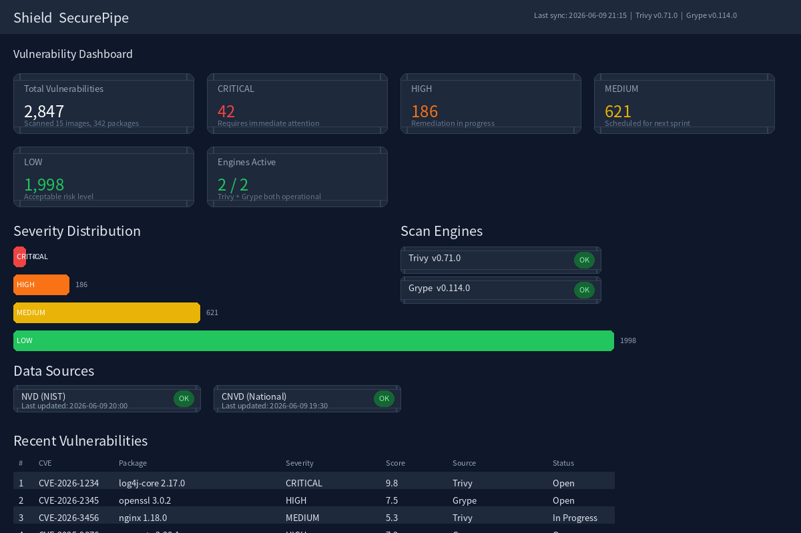
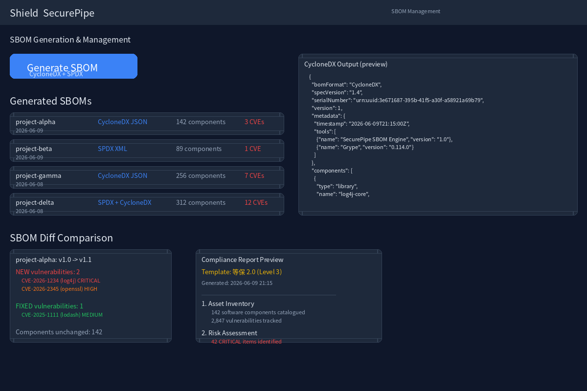
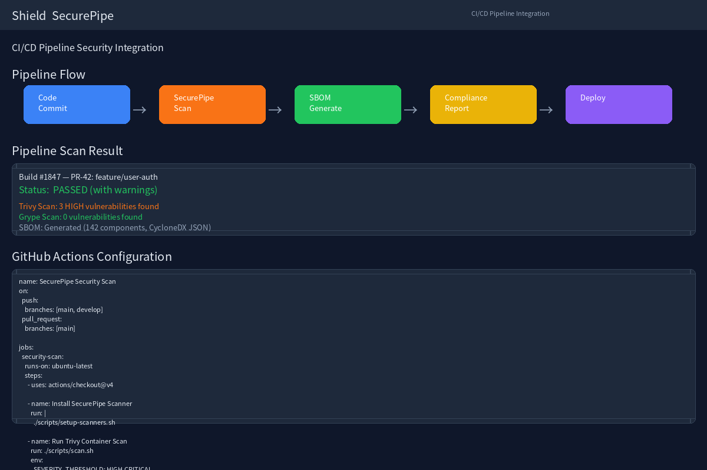

# SecurePipe — 销售材料

## Listing Title

SecurePipe — CI/CD 软件供应链安全平台，多引擎扫描 + SBOM 管理 + 等保合规

## Pitch Summary

基于 Trivy + Grype 的多引擎安全扫描与 SBOM 管理平台。一次扫描覆盖容器/依赖包/IaC 全栈，自动生成等保 2.0 合规报告。CI/CD 流水线左移集成，高危漏洞在代码提交阶段即被发现。支持 CNVD 中文漏洞库，数据不出境，私有化部署。Snyk 1/5 成本，DevSecOps 原生。

## 核心卖点

| 卖点 | 说明 |
|------|------|
| 多引擎聚合 | Trivy + Grype 双引擎，漏洞检出率比单引擎提升 40%+ |
| 等保合规 | 内置等保 2.0 模板，合规报告从 1 周缩短到 10 分钟 |
| CNVD 集成 | 支持国家信息安全漏洞共享中心中文库，数据不出境 |
| CI/CD 左移 | GitHub Actions/Gitee/Jenkins 原生插件，提交即扫描 |
| 私有化部署 | 数据完全自控，满足金融/政企安全要求 |
| SBOM 管理 | CycloneDX/SPDX 双格式，版本追踪、差异对比 |

## 目标客户

- **金融/政企 IT 安全部门** — 等保/关基合规刚需
- **中大型企业 DevSecOps 团队** — 需自动化供应链安全检查
- **安全服务公司（MSSP）** — 向客户提供供应链安全审计服务

## 定价

| 版本 | 价格 | 包含内容 |
|------|------|----------|
| 标准版 | ¥250,000 | 私有化部署 + 多引擎扫描 + SBOM 管理 + 基础合规报告 + 钉钉/企微告警 |
| 专业版 | ¥500,000 | 标准版全部 + CI/CD 流水线插件 + 等保 2.0 全套模板 + 漏洞趋势分析 + CNVD 集成 |
| 企业版 | ¥800,000 + ¥120,000/年技术支持 | 专业版全部 + 多项目管理 + RBAC + 自定义报告模板 + 专属技术支持 |

## Demo 截图

### 截图 1：漏洞聚合仪表盘

多引擎聚合漏洞视图，按 Severity/组件/CVE 分组展示。实时同步 NVD + CNVD 漏洞数据源。

### 截图 2：SBOM 管理与差异对比

CycloneDX/SPDX 双格式 SBOM 生成，版本间差异对比，合规报告预览。

### 截图 3：CI/CD 流水线集成

GitHub Actions 原生集成，每次代码提交自动触发扫描、生成 SBOM、产出合规报告。

## Demo 视频

- **文件：** [docs/demo/securepipe_demo.mp4](demo/securepipe_demo.mp4)
- **时长：** 70 秒
- **内容：** 完整核心流程演示（仪表盘 → SBOM 管理 → CI/CD 集成）

## 竞品对比

| 特性 | SecurePipe | Snyk | Sonatype Nexus |
|------|------------|------|----------------|
| 多引擎扫描 | ✅ Trivy+Grype | ✅ 自研 | ✅ 自研 |
| CNVD 中文库 | ✅ | ❌ | ❌ |
| 等保合规报告 | ✅ | ❌ | ❌ |
| 私有化部署 | ✅ | ❌ (仅企业版) | ✅ |
| 数据不出境 | ✅ | ❌ | ❌ |
| 价格 (标准) | ¥25万/年 | $50万+/年 | $40万+/年 |
